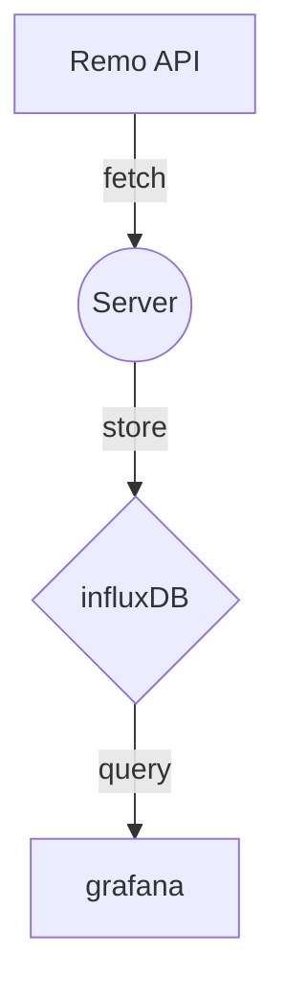

# Monitoring Home

I'd like to gather information about home situations.

## Architecture

Basically, a server executes a script to gather data from the Nature Remo API once per minute.

And the data fetched from there will be stored in a database named influxDB.

## Environment

| Key | Value |
| --- | ----- |
